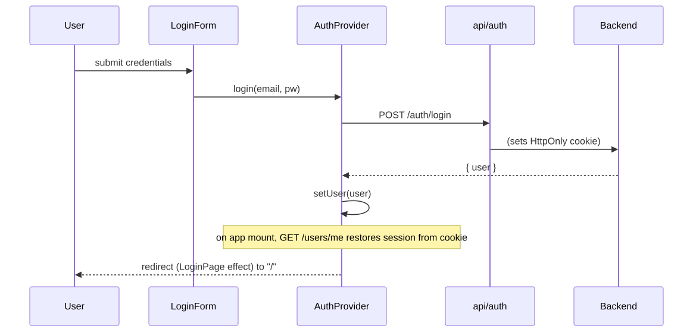

# Frontend Architecture Diagrams

Generated from the Mermaid sources in [`diagrams/`](./diagrams). Each diagram has a
`.mmd` source plus rendered `.svg` (scalable) and `.png` (2×) images.

To regenerate after editing a `.mmd`:

```bash
# from frontend/
PUPPETEER_SKIP_DOWNLOAD=true npm install --no-save @mermaid-js/mermaid-cli puppeteer
cd docs/diagrams
../../node_modules/.bin/mmdc -p puppeteer.json -i 01-architecture.mmd -o 01-architecture.svg
```

## 1. Layered architecture (module dependencies)


## 2. Routing map


## 3. Editor component hierarchy (`/map/:id`)


## 4. Editor state & data flow


## 5. API layer → backend endpoints


## 6. Auth / session sequence

